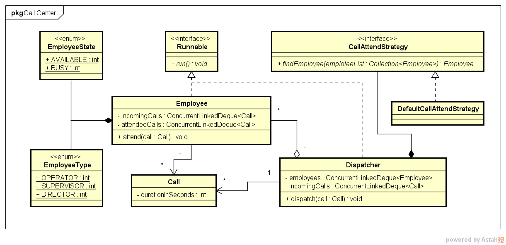

# Call Center Exercise

This exercise consists of a Call Center model where 3 types of employee work: *OPERATOR*, *SUPERVISOR* and *DIRECTOR*.

The main objective is to handle incoming calls and assign them to employees through a *Dispatcher*.

## Solution

The main solution is to use threads were Employees may work (attend calls, that are just invocations to *sleep* methods).

In order to handle more calls than the employees can handle, they are put in a concurrent queue and wait until some employee becomes available.

There are a couple of informational logging calls left intentionally to understand the code easily while running tests. 



## Prerequisites

Java JDK 8 and Maven are required to run the project.

## Compiling

As in any Maven project, it may be required to run

```bash
mvn clean install
```

## Author

* **Sebastian D'Agostino**
